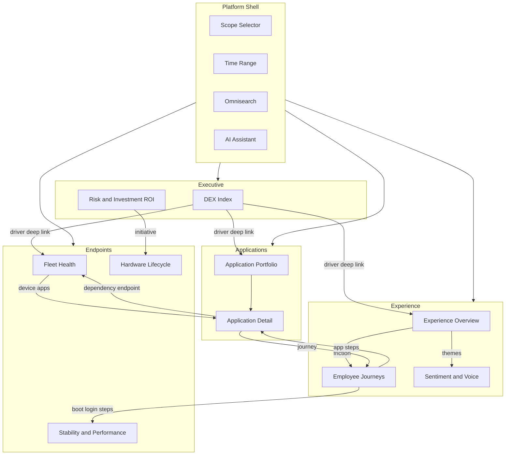
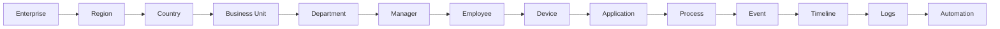

# AetherDEX Session 1 — Capability Map

```mermaid
flowchart TB
  subgraph Shell["Platform Shell"]
    Scope[Scope Selector]
    Time[Time Range]
    Search[Omnisearch]
    AIAssist[AI Assistant]
  end

  subgraph Exec["Executive"]
    DEX[DEX Index]
    Risk[Risk and Investment ROI]
  end

  subgraph Exp["Experience"]
    Overview[Experience Overview]
    Journeys[Employee Journeys]
    Sentiment[Sentiment and Voice]
  end

  subgraph End["Endpoints"]
    Fleet[Fleet Health]
    Stability[Stability and Performance]
    Lifecycle[Hardware Lifecycle]
  end

  subgraph Apps["Applications"]
    Portfolio[Application Portfolio]
    Detail[Application Detail]
  end

  Shell --> Exec
  Shell --> Exp
  Shell --> End
  Shell --> Apps

  DEX -->|driver deep link| Fleet
  DEX -->|driver deep link| Portfolio
  DEX -->|driver deep link| Overview
  Risk -->|initiative| Lifecycle
  Overview -->|friction| Journeys
  Overview -->|themes| Sentiment
  Journeys -->|boot login steps| Stability
  Journeys -->|app steps| Detail
  Fleet -->|device apps| Detail
  Portfolio --> Detail
  Detail -->|dependency endpoint| Fleet
  Detail -->|journey| Journeys
```

## Drilldown Grammar

```mermaid
flowchart LR
  E[Enterprise] --> R[Region] --> C[Country] --> B[Business Unit]
  B --> D[Department] --> M[Manager] --> Emp[Employee]
  Emp --> Dev[Device] --> App[Application] --> Proc[Process]
  Proc --> Ev[Event] --> T[Timeline] --> L[Logs] --> A[Automation]
```
