# Windows Client UI — Walkthrough

**Open the full visual document:** [WALKTHROUGH.html](./WALKTHROUGH.html) · Word: [Windows-Client-UI-Walkthrough.docx](./Windows-Client-UI-Walkthrough.docx)

**Images:** [`screenshots/`](./screenshots/) (18 PNGs)  
**App:** Nanoheal Windows Electron launcher (`NH_Client_UI`) — end-user self-service for fixing common PC issues without opening a ticket first.

---

## How the product works (user journey)

1. **Install** — device is checked, user accepts terms, client installs.
2. **Home** — user searches or picks a category (Browser, Disk, Microsoft, etc.).
3. **Run a fix** — pick a resolution → **Fix now** → Nanoheal runs the remediation on this PC.
4. **History** — see what ran and when.
5. **Still stuck?** — Call, Email, or Chat from **Still Facing Issues?** (or the floating Nanoheal chat icon).
6. **Feedback** — optional survey after a fix.

Categories and fixes are driven by the site’s **toolbox / knowledge base** (synced from the server), so labels can differ by customer.

---

## Installation pages

### Prerequisite — System Requirements Verification

**Route:** `/prerequisite`

**What this module is:** A pre-install safety check. Nanoheal verifies the PC can host the agent before files are written.

**What the user sees / can do:**
- Watch automated checks complete (proxy, drivers, OS compatibility, RAM, OS version, internet, disk space, certificates).
- Green checkmarks mean that item passed.
- Follow the progress bar; when checks finish successfully, installation can continue.
- Change language from the header if needed.
- No manual action is required on a healthy PC other than waiting.

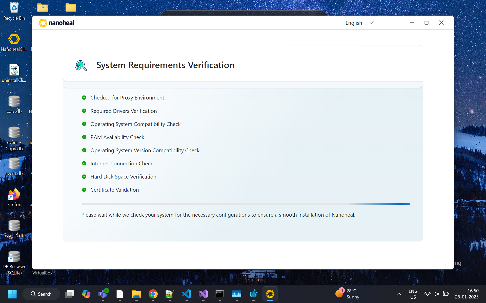

### Acknowledgement — Terms & Install

**Route:** `/Ack`

**What this module is:** Legal consent before Nanoheal is installed on the device.

**What the user can do:**
- Read the welcome / legal message and open **Legal** (terms) if linked.
- Tick **I acknowledge…** to accept Terms and Conditions (required).
- Click **Install** to start installation, or **Cancel** to abort.
- Switch language (e.g. English) in the header.

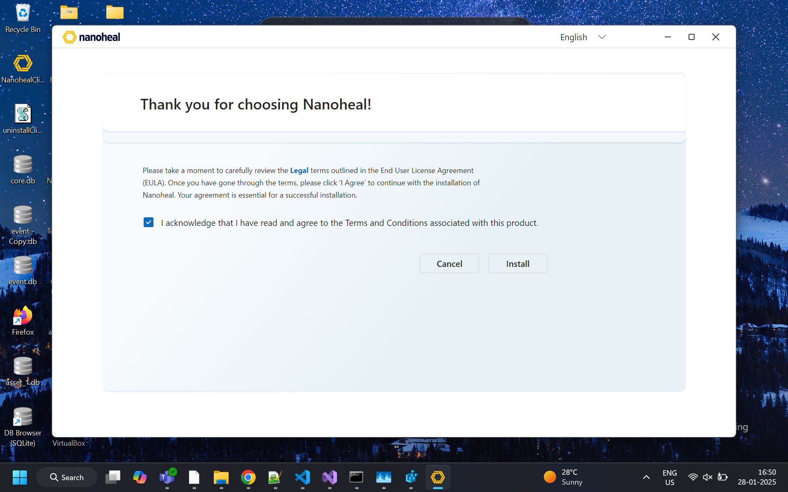

### Please Wait — Installation

**Route:** `/pleaseWaitInst`

**What this module is:** A blocking progress screen while the client installs and configures services.

**What the user can do:**
- Wait while Nanoheal installs; do not close the window mid-install.
- Read status messages and watch the progress indicator.
- After success, the post-install home (Landing) opens automatically.

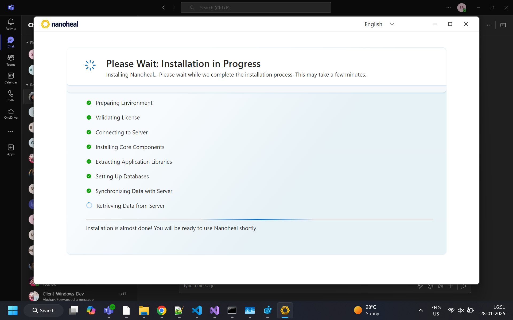

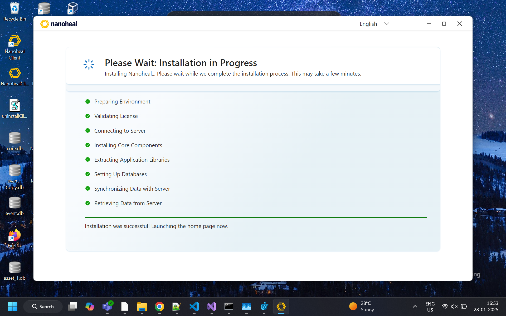

---

## Post-installation — home & device

### Landing Page (Home)

**Route:** `/landingPage`

**What this module is:** The main self-service hub after install. Everything useful starts here: find a fix, see recent activity, or escalate to support.

**What the user can do:**
- Read the greeting and **Welcome to Nanoheal**.
- Open **Device Details →** to see this PC’s identity and specs (helpful when talking to IT).
- Use **Sync Now** (when shown) to refresh the knowledge base / last sync time from the server.
- Type in **Search for resolutions** and press **Search** (or pick a suggestion) to find fixes by symptom or app name.
- Choose a **category tile** to browse fixes by area, for example:
  - **Microsoft Issues** — Outlook, Office, Windows-related remediations
  - **Enterprise App Issues** — company / store apps
  - **Browser Issues** — Chrome, Edge, Firefox performance and cleanup
  - **System Reboot** — controlled restart-related help
  - **Sound / Display / Disk Space Issues** — media, screen, and storage fixes
- Use **Frequently used resolutions** (right panel) to re-run fixes they’ve used before (fills in after they run solutions).
- Open **Service History →** to see past runs on this device.
- If nothing works: use footer **Still Facing Issues?** → **Call Us**, **Email Us**, or **Chat Now**.
- Open the floating **Nanoheal** chat icon (bottom-right) when the chat widget is enabled.

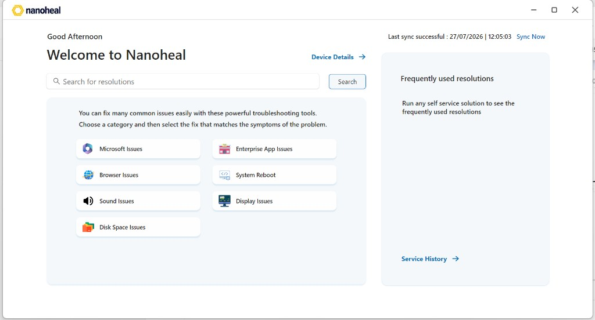

### Device Details

**Route:** `/deviceDetails`

**What this module is:** A read-only (or lightly interactive) profile of the current machine for support and troubleshooting context.

**What the user can do:**
- View device identity and hardware / software facts used by Nanoheal and IT.
- Share or read details when raising a ticket or chatting with support.
- Go **Back** to return to Home.

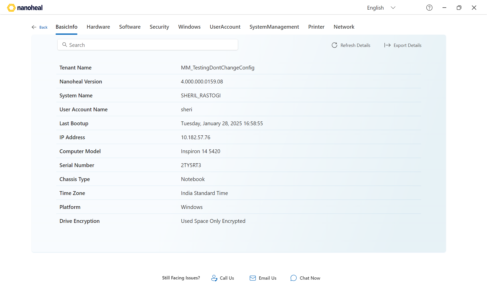

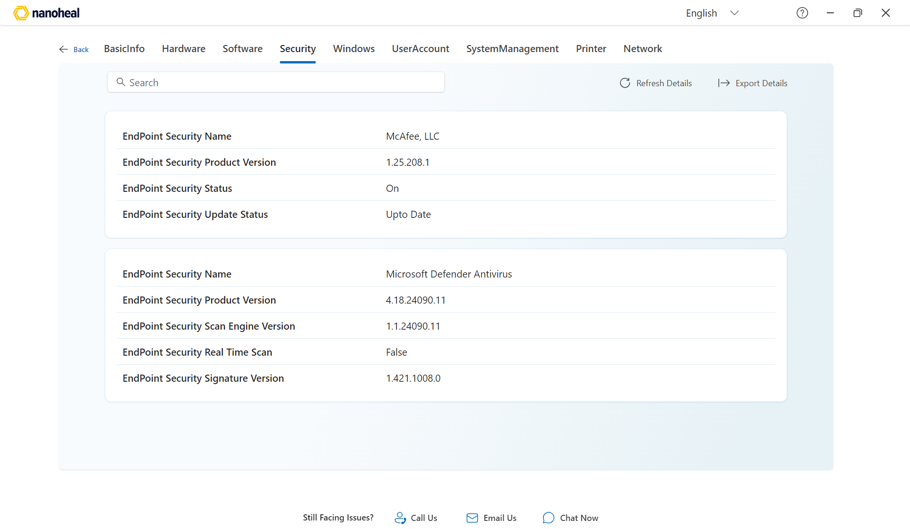

### Service History

**Route:** `/serviceHistory`

**What this module is:** An audit log of what Nanoheal has already done on this PC.

**What the user can do:**
- Switch tabs to filter activity types:
  - **HistoryDetails** — overall run history (name, date, duration)
  - **Autoheal** — automatic remediations
  - **Selfhelp** — user-triggered fixes
  - **Proactive** — background / proactive actions
  - **Schedule** — scheduled work
- **Search for logs** to find a specific run.
- **Refresh Details** to reload from the agent.
- **Export Details** to save history for IT.
- Go **Back** to Home.

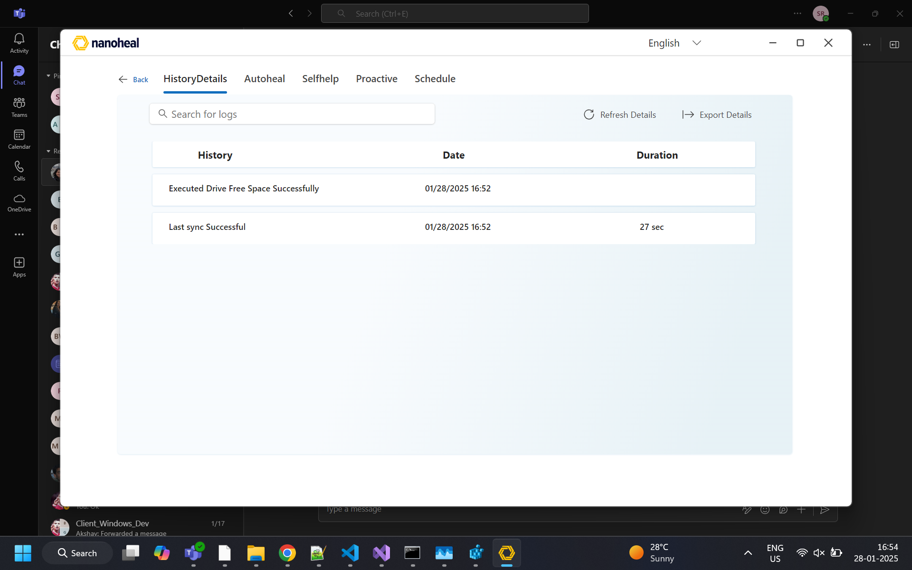

### Search results

**Route:** `/searchResults`

**What this module is:** Results from the home search box — a list of matching resolutions from the catalog.

**What the user can do:**
- Browse result cards (e.g. Outlook issues, Teams issues, sluggish PC, boot time, audio troubleshooter).
- Open a card to go to that fix and run it.
- Refine the search query and search again.
- Go **Back** to Home.

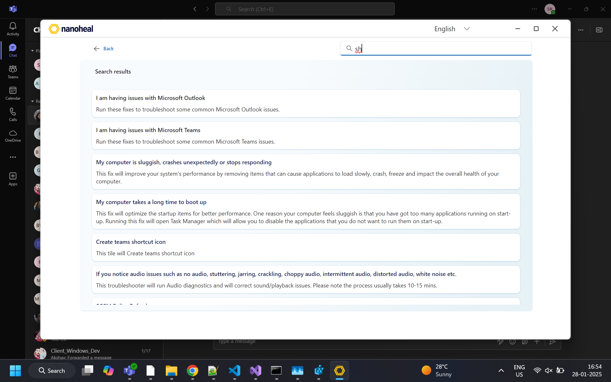

---

## Solution catalog (toolbox)

### L2 Tile — category (e.g. Browser Solutions)

**Route:** L2 category pages (toolbox-driven)

**What this module is:** A category landing page. User picks *which product or sub-area* they care about (e.g. Chrome vs Firefox).

**What the user can do:**
- Read the category title and short description.
- Select an item in the left list (e.g. Chrome, Firefox, Internet Explorer).
- Click **View Solutions** to open the list of fixes for that item (L3).
- Use **Search for resolutions** from the header.
- Use breadcrumb **Home > …** or **Back** to leave.
- Tap **Update Now** if the knowledge base is stale (syncs catalog from server).
- Escalate via **Still Facing Issues?** if needed.

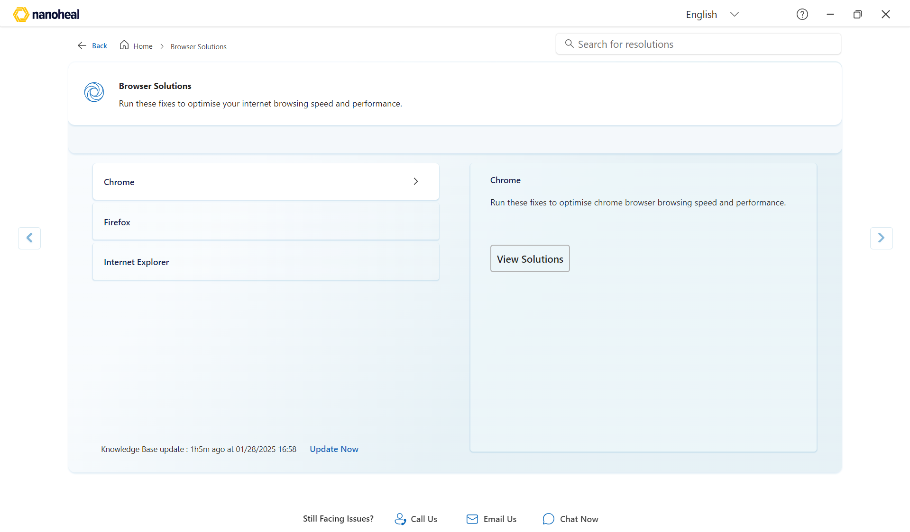

### L3 Tile — fix detail (e.g. Chrome)

**Route:** `/browserSolution` (and similar L3 pages)

**What this module is:** The runnable fix screen. Left = list of resolutions; right = details for the selected one.

**What the user can do:**
- Select a fix on the left (e.g. “Clear Google Chrome Temp files”).
- Read the description and any warnings (e.g. close the browser first).
- Click **Fix now** to run the remediation on this PC.
- Use side arrows (when shown) to move between related items.
- Sync the knowledge base with **Update Now**.
- If the fix fails or doesn’t help: use footer Call / Email / Chat.

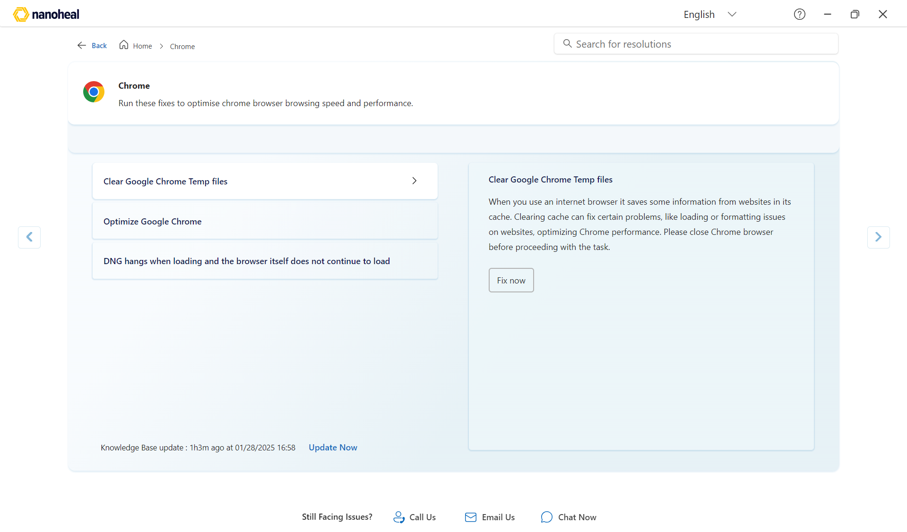

---

## Support footer (Still Facing Issues?)

Always available on Home and solution pages when configured. Use when self-service did not solve the problem.

### Call Us

**What this module is:** Phone support directory by region.

**What the user can do:**
- Open the **Still Facing Issues?** modal and select **Call Us**.
- Pick their region and dial the listed number during published hours.
- Switch to **Email Us** or **Chat Now** without leaving the modal.

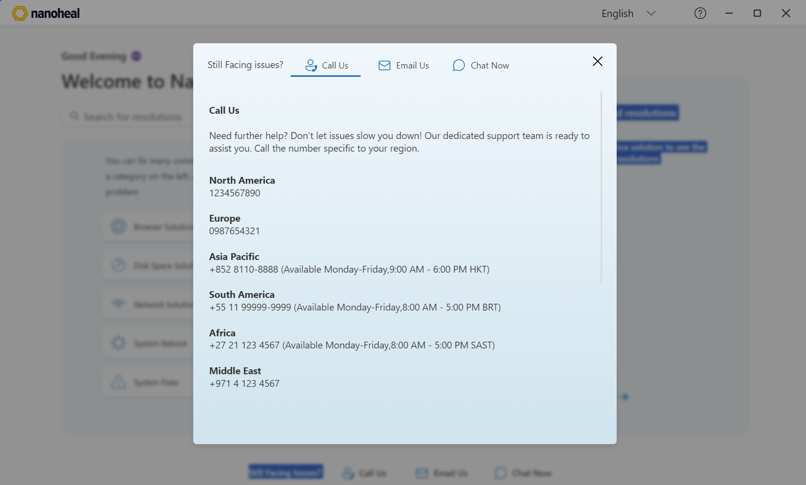

### Email Us

**What this module is:** Email escalation using the site’s configured support address.

**What the user can do:**
- Open **Email Us** and follow the on-screen address / compose flow.
- Describe the issue and (optionally) mention Device Details / Service History.

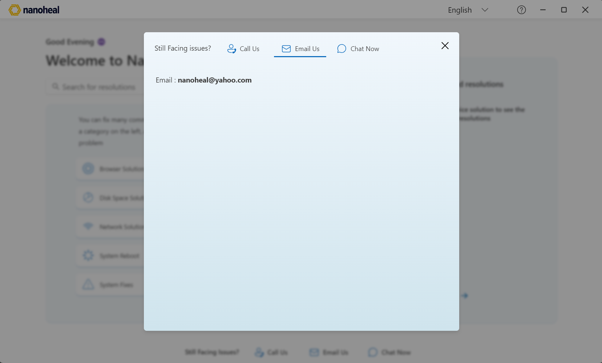

### Chat Now (existing footer entry)

**What this module is:** Live chat escalation. Opens the configured chat URL (`ChatLinkNew`) or the in-app widget (`WidgetLink`).

**What the user can do:**
- Click **Chat Now** (footer or modal tab) or the on-modal **Chat** button.
- Sign in if prompted (Microsoft account for the org) — **Nanoheal logo** (ADM removed).
- Chat with support / bot and get guided to a fix or a ticket.

---

## Agent Chat & survey

Landing chrome stays as-is. Survey and chatbot share the **Nanoheal Agent Chat** UI.

### User Survey — Agent Chat UI

**What this module is:** Feedback survey in **Nanoheal Agent Chat** chrome (logo + Agent Chat header, orange agent avatar, option buttons, “Describe your issue or share feedback”).

**What the user can do:**
- Rate the fix (stars).
- Choose an outcome chip: resolved / partial / still broken / couldn’t run.
- Optionally type a short note and send.

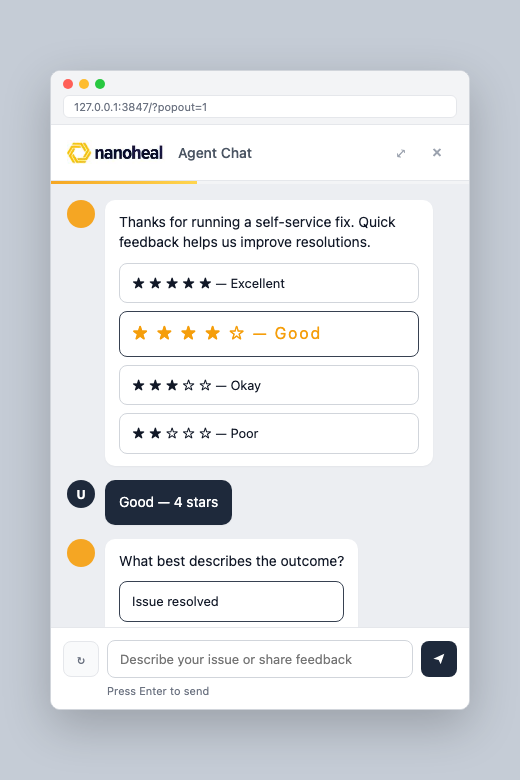

### Chatbot — conversation

**What this module is:** **Nanoheal Agent Chat** — issue flow with remediation options and self-help automation (example: Teams crash).

**What the user can do:**
- Describe the issue.
- Pick a remediation option.
- Run self-help automation when offered.

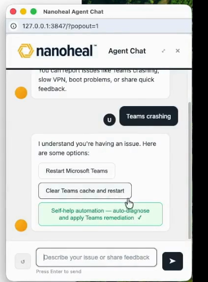

### Chatbot — greeting

**What this module is:** **Nanoheal Agent Chat** greeting — “Hi! What can I help you with today?”

**What the user can do:**
- Type an issue or share feedback.
- Press Enter / send.

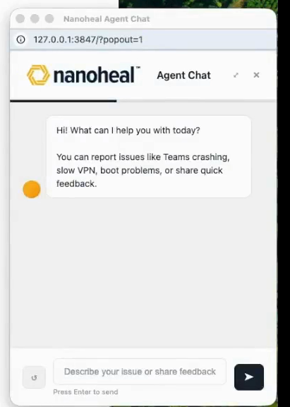

### Chat Now — Sign in (Nanoheal branded)

**What this module is:** Microsoft “Sign in to your account” after Chat Now. Shown here with **Nanoheal logo** (ADM removed).

**What the user can do:**
- Enter work email and continue SSO.
- Use **Can’t access your account?** if locked out.
- After sign-in, continue into the chat session.

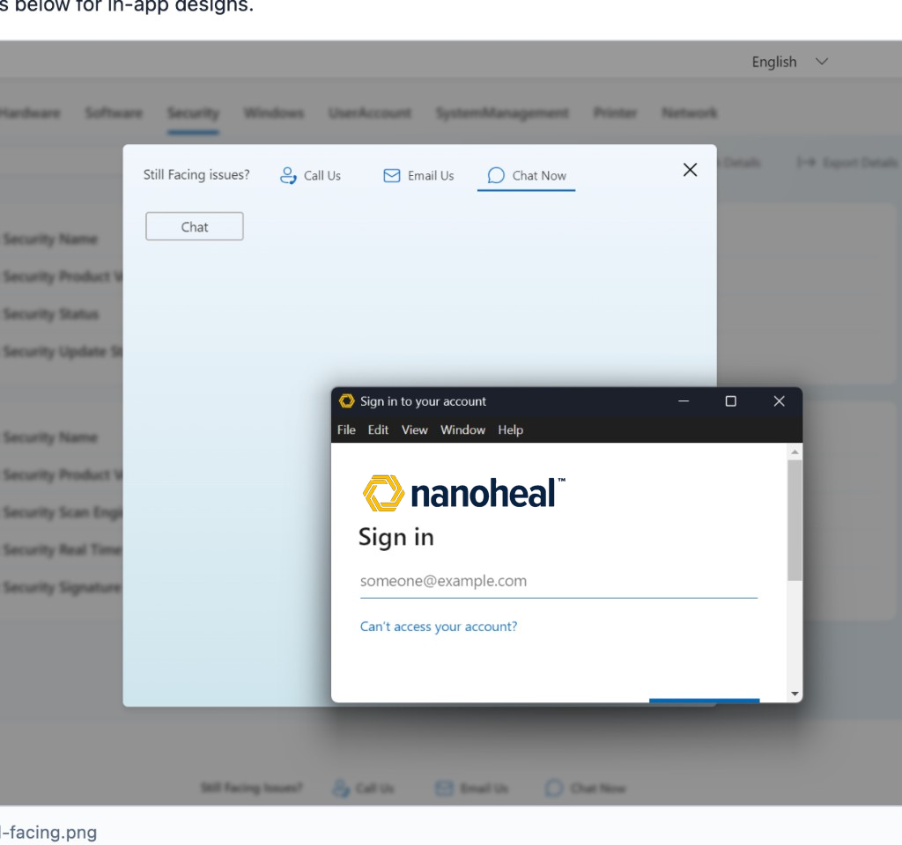

**Production note:** Live sign-in branding comes from **Microsoft Entra ID company branding** for the chat URL tenant. Electron only opens `ChatLinkNew`.

---

## Image index

| # | File | Page |
|---|------|------|
| 01 | `01-prerequisite.png` | Prerequisite |
| 02 | `02-acknowledgement.png` | Acknowledgement |
| 03–04 | `03` / `04-please-wait-install*.png` | Please Wait |
| 05 | `05-landing.png` | Landing / Home |
| 06–07 | `06` / `07-device-details*.png` | Device Details |
| 08 | `08-service-history.png` | Service History |
| 09 | `09-search.png` | Search |
| 10 | `10-l3-tile.png` | L3 fix detail |
| 11 | `11-l2-tile.png` | L2 category |
| 12–14 | footer `12`–`14` | Call / Email / Chat |
| 15 | `15-user-survey.png` | Survey (Agent Chat UI) |
| 16–17 | `16` / `17-chatbot-*.png` | Agent Chat conversation / greeting |
| 18 | `18-chat-signin-nanoheal.png` | Chat sign-in (Nanoheal) |
